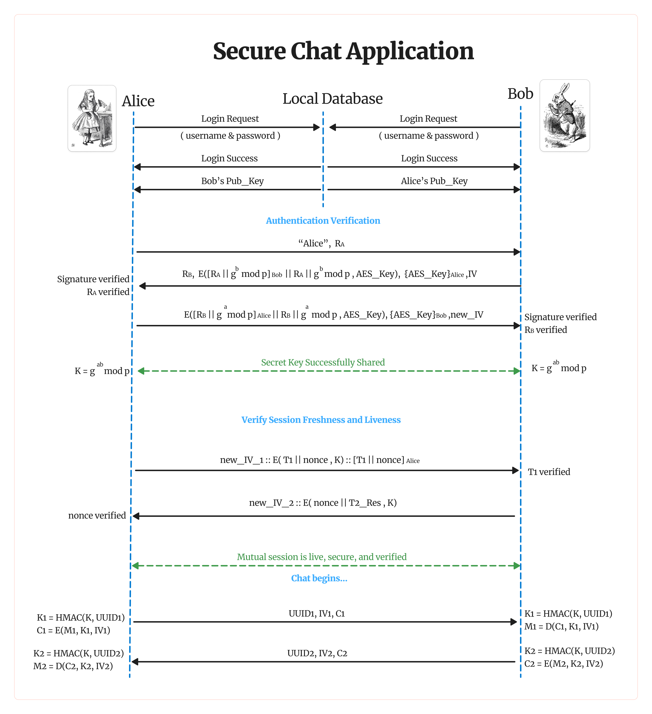

# 🔐 Secure Chat Application

A Java-based **end-to-end encrypted peer-to-peer (P2P) chat application** that enables secure messaging between users using **Diffie-Hellman key exchange**, **AES encryption**, and **digital signatures**. Authentication and public key sharing are mediated by a local server using **SQLite**.



---

## 🚀 Features

✅ Secure registration and login using username/password  
✅ Passwords stored with **bcrypt** and **cryptographic salt**  
✅ Mutual authentication with RSA digital signatures  
✅ Diffie-Hellman key exchange for AES session key generation  
✅ AES-GCM encrypted chat messages with IVs and UUID-based HMACs  
✅ Session freshness and replay protection using timestamps + nonces  
✅ SQLite-based audit logging and credential storage  
✅ Color-coded console UI for a better CLI experience

---

## 🔒 Protocol Overview

### 1. 🔑 Authentication Phase
- Both Alice and Bob authenticate with the local server
- Public keys are retrieved from the database

### 2. 🤝 Mutual Verification & Key Exchange
- Both peers exchange signed Diffie-Hellman components
- Verify signatures and generate the shared secret:
K = g^(ab) mod p
- Shared key is used for AES encryption

### 3. 🧠 Session Verification
- Alice and Bob exchange nonces + timestamps to ensure liveness
- Freshness is validated before starting chat

### 4. 📡 Secure Messaging
- Messages are encrypted using AES-GCM
- Every message includes:
   - IV
   - UUID-based HMAC
   - Authenticated cipher text

---

## 🛠️ Tech Stack

- **Java 17**
- **Java Cryptography API**
- **Socket Programming (TCP)**
- **SQLite (via JDBC)**
- **bcrypt (for password hashing)**
- **RSA / AES / HMAC / UUID / IVs**

---

## 🧪 Modules Overview

| Module                     | Description                                       |
|----------------------------|---------------------------------------------------|
| `peer.PeerOne / PeerTwo`   | Main clients to host or connect as a peer        |
| `chat.ChatSender / Receiver` | Send/receive AES-encrypted messages            |
| `crypto.RSAUtil / AESUtil` | Cryptographic operations (RSA, AES, IVs, HMAC)   |
| `KeySender / KeyReceiver`  | Secure mutual authentication + key relay        |
| `SessionVerifier`          | Ensures freshness using nonces and timestamps    |
| `database.AuthLogger`      | Logs session/auth events to SQLite              |
| `database.UserAuthManager` | Handles user registration and login             |
| `color.ConsoleColors`      | Console output formatting                        |

---

## 📋 How to Run

### Prerequisites:
- Java 17+
- SQLite JDBC driver (already included)

### Steps:

1. **Clone the repository:**
 ```bash
 git clone https://github.com/J-Praveenan/Secure-Chat-Application.git
 cd Secure-Chat-Application
```
2. **Open two terminal/IDE sessions:**
   - Run `PeerOne.java` in one
   - Run `PeerTwo.java` in the other

3. **Register and login users**
   - Register `alice` and `bob`
   - Each peer logs in separately

4. **Choose roles**
   - One peer selects `host`, the other `connect`
   - Enter peer IP and port

5. ✅ **Start chatting securely!**

## 🔐 Security Design
- Passwords are hashed using `bcrypt` with random salt
- AES session keys are generated via Diffie-Hellman securely
- No keys or sensitive data are sent in plaintext
- Nonces and timestamps prevent replay attacks
- All authentication and session events are logged

## 📁 File Structure
 ```bash
Secure-Chat-Application/
├── chat/ # Sender/Receiver logic
├── crypto/ # RSA, AES, HMAC utilities
├── database/ # SQLite DB handlers
├── peer/ # Main apps (PeerOne, PeerTwo)
├── color/ # Console UI formatting
├── IS_ChatApplication.jpg # Secure protocol diagram
└── README.md # You're here
```
